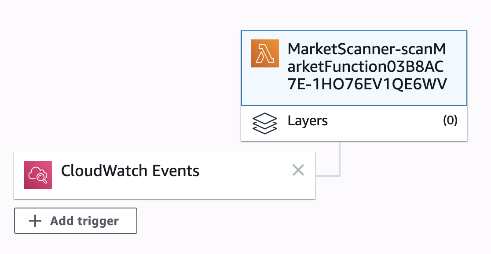

# AWS RSS Scanner

### A Lambda function which scans an RSS feed every 10 minutes via CloudWatch

This Lambda function scans an RSS feed to check for new entries and saves their IDs to an S3 bucket. If there are any new IDs which are not found in the bucket, then it will transform the RSS feed into an HTML report and send it via e-mail using AWS SES. The lambda function is being called every 10 minutes by a CloudWatch event.

### Tech stack

- TypeScript
- Jest
- AWS: Lambda, S3, CloudWatch, SES
- AWS CDK

### Installation

Clone this repo and run `npm i`.

### Deployment

The application is deployed using AWS CDK. You can find more about it [at this url](https://docs.aws.amazon.com/cdk/latest/guide/getting_started.html).

After setting up CDK, all you need to do is run `npm run build` which will:

- Build the typescript source code found under [src](./src)
- Deploy the lambda function along with the CloudWatch event and the S3 Bucket using the [CDK code](./deploy.ts) included. In order to know that things are going in the right direction, this is more or less what you should see in your terminal as things progress:

#### Pre deploy

#### Post deploy

#### The AWS lambda console

The rest will be taken care of, as AWS will start running your newly deployed lambda function and scan the RSS feed every 10 minutes for new entries.